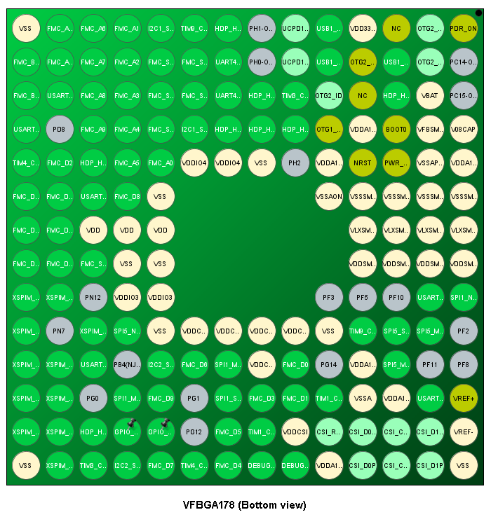

# Design Notes

## Ballout

- This section was completed *after* wiring the Power and Analog units, as well as the NOR Flash unit in the schematic. However it is important, so it'll be at the top.
- There's a spreadsheet for the BGA pinout, can be found [here](https://docs.google.com/spreadsheets/d/1W3wl7rZQ2mxVOFGO9Ns9zJrD_qd8Au_sG3PKxmy8APU/edit?usp=sharing). It has *all* the balls, but the ones we need have been checked off, and most have signals labeled next to them.
- The pinout was generated in STM32CubeMX, and the configuration has been stored in [`Software/`](../../Software).
- The ballout from the CubeMX's UI is shown below. It isn't very detailed in the photo, so consulting the spreadsheet (or better, git pull and open in CubeMX) is highly recommended.

The STM32's **connection with the main board** will be through a set of two 18 pin header pins on each side of the stm32. These pins will be as follows, top to bottom:

| Left | Right |
|:----:|:-----:|
| 5V | 5V |
| GND | GND |
| UART1-TX | UART2-TX |
| UART1-RX | UART2-RX |
| UART3-TX | UART4-TX |
| UART3-RX | UART4-RX |
| SPI1-MISO | SPI5-MISO |
| SPI1-MOSI | SPI5-MOSI |
| SPI1-CS | SPI5-CS |
| SPI1-CLK | SPI5-CLK |
| I2C1-SDA | I2C2-SDA |
| I2C1-SCL | I2C2-SCL |
| TIM1-CH1 | TIM3-CH2 |
| TIM1-CH2 | TIM3-CH3 |
| TIM4-CH1 | TIM9-CH1 |
| TIM4-CH2 | TIM9-CH2 |
| 5V | 5V |
| GND | GND |

- Putting 5V *and* ground on each side promotes better current flow through the ground planes I believe. This will allow charges to flow in the direction to the nearest ground.
- 5V pins will have reverse polarity protection diodes.
- All pins are technically GPIO pins, but they can also be used specifically for the tasks displayed. The timer pins are capable of PWM, and analog read upto 1v8.

## Power

- VDD has 7 capacitors because:
    - 3 VDD pins
    - 2 VDDIO3 pins
    - 2 VDDIO4 pins
- VDDCORE has 6 capacitors because:
    - 5 VDDCORE pins
    - 1 VDDCSI pin
- VDDA1V8 has 4 capacitors because:
    - ADC, CSI, USB, and PLL power
- ***NOTE:*** In PCB design, keep decoupling capacitors close to the BGA chip.

- Notes on Power Pinout:
    - Will obviously need a ground pin or two
    - Input voltage pin will be 5V, with a max of 3A consumption (Buck converter on main board). Use IPC-2221 to determine trace widths. 
        - The hardware development AN suggests using a 4 (if not 6) layer PCB with the inner layers being strictly ground and power planes.
    - V\_DD and V\_DDA18AON ***need to start first*** according to the boot order. The rest of the pins can be powered after. Thus:
        - V\_DD and V\_DDA18AON must be powered off two *separate* (crucial for analog signal integrity) LDO's.
        - V\_DDA1V8 will then be powered by an LDO off of the 5V input, *with PWR\_ON on the enable pin*.
        - V\_DD1V8 and V\_DD3V3 should be powered by buck converters off 5V for high power. Again *PWR\_ON TO ENABLE PIN*.
    - V\_DDA1V8PMU is powered off V\_DD1V8, with 50R@100MHz ferrite and 100n bypass cap in between.

## Analog Unit

- USB:
	- DP and DM are differential pairs, with 90 Ohms between them, or 45 Ohms each between them and ground.
	- Length matching within a pair should be within 2mm, and maximum trace length no longer than 200mm.
	- Ideally route DP and DM over a ground plane.
	- Using the ECM42-40A100N6 to filter noise.
	- Both CC pins have been pulled down. To change configuration, unsolder R24 or R25.
	- USB Power Details:
		- When connected to a host via USB C, VBUS will be able to power 5V via the diode D5. 
		- When *acting* as a USB host (`EN = 1`), the NMOS will enable VBUS to be powered by 5V.
		- If connected to a host, but also powered by 5V rail, VBUS and 5V will be powered separately, *but to the same voltage*, so theoretically I\_D should be 0.
		- Same situation as above if acting as a host, and for some reason a device supplies 5V on VBUS
		- If, for any reason, there's a flaw in this design, **unsoldering D5** should fix it, but external powering capabilities will vanish.
- CSI
	- The 3 pairs of P and N pins for the CSI peripheral are also *differential pairs*. There's 100 Ohms impedance between them, and 50 Ohms between each of them and ground.
	- Length matching within a pair must be within 0.1mm, and between clock and data pairs 2.5mm.
	- Route over a ground plane.
	- Trace lengths must not exceed 200mm.
- General
	- NRST is internally pulled up via 40k Ohms. Thus, the button debouncing cap will have a H-L time constant of 1ms, and L-H of 4ms.
	- NRST will also be connected to a GPIO, which one is to be determined.

## XSPI NOR Flash

- Pin configurations
	- Uses pins PN[0..12]
	- CS is active low, on pin PN1
	- CLK is on PN6
	- DQS (Data Strobe) is on pin PN0
	- Serial IO pins are on PN[2..5] and PN[8..11]
	- 3V supply by separate LDO using label VDD_OCTO
- Capacitors should be placed close to supply pins, in pairs of 4.7u and 100n.
- SIO pins to be length matched to within 10mm (I say 1-5mm), and impedance matched to 50 Ohms between trace and ground.
- Differential pairs must have trace impedance of 100Ohms between them.
- Trace capacitance not to exceed 20pF, and trace length not to exceed 120mm (use resistor termination otherwise; not doing this).
- External push button to reset the Flash. Once development is complete, R28 can be unsoldered to prevent accidentally deleting data.
- NRST connected to the reset button through a diode.
